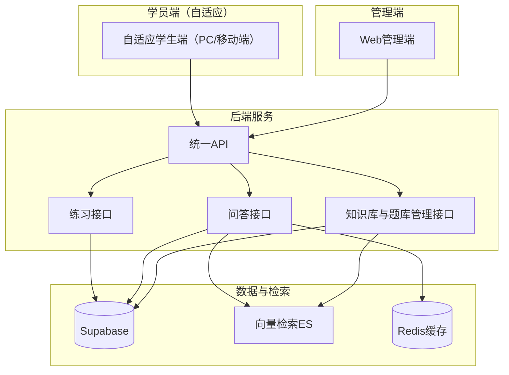
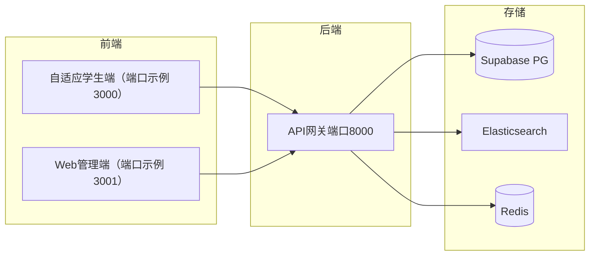
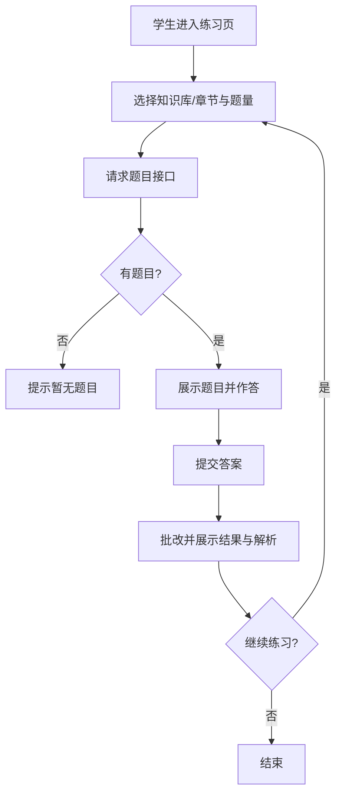
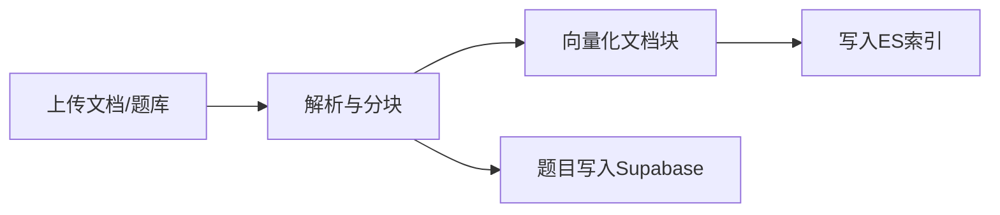
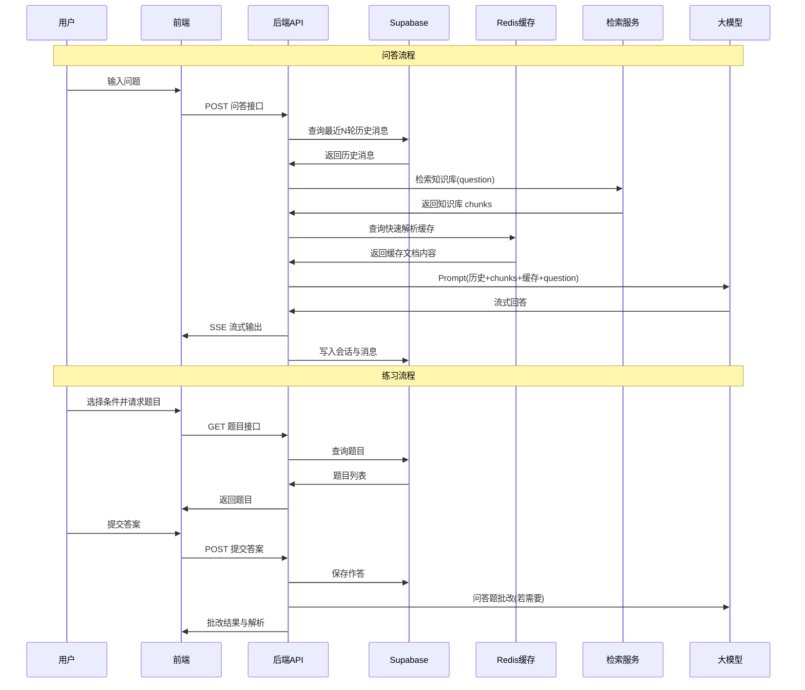
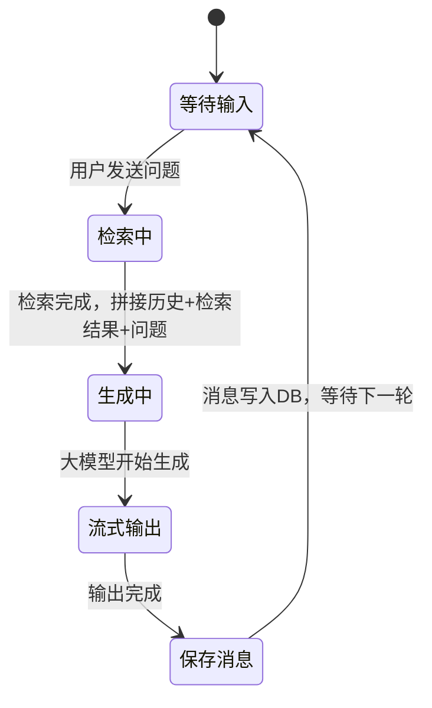

# AI 演练工具 产品需求文档 (PRD)

---

# 1. 开发版本及文档修订记录

## 1.1 版本规划

### V1.0 MVP 可用

**核心目标**：为培训机构提供基于专业知识库的 AI 陪练能力，学员可随时进行选择题/问答题练习与自由问答，机构可上传知识库与题库并配置练习。

**修订人**：产品

| 模块           | 功能项                   | 说明                                                  |
| -------------- | ------------------------ | ----------------------------------------------------- |
| 智能文档知识库 | 文档上传与解析           | 支持 PDF/Word/Txt 等格式，解析后分块入库              |
| 智能文档知识库 | 题库导入                 | 支持机构导入结构化选择题/问答题                       |
| 智能问答       | 基于知识库问答           | RAG 检索 + 大模型生成，引用标注、推荐问题             |
| 练习与题目     | 选择题/问答题练习        | 学生获取题目、提交答案、获得批改反馈                  |
| 管理端         | 知识库与题库管理         | 上传、编辑、删除；练习配置（范围、题量）              |
| 双端入口       | 自适应学生端、Web 管理端 | 学生端（自适应 PC/移动端）练习+问答，管理端上传与配置 |
| 基础设施       | Supabase 数据库          | 替代自建 Postgres，统一存储                           |

---

### V1.1 后续规划（示例）

**核心目标**：扩展面试题库与模拟面试能力（本期不做）。

**修订人**：产品

| 模块 | 功能项   | 说明              |
| ---- | -------- | ----------------- |
| 面试 | 面试题库 | 机构维护面试题    |
| 面试 | 模拟面试 | AI 考官多轮对话等 |

---

## 1.2 文档修订记录

| 版本 | 修订日期   | 修订人 | 修订内容 |
| ---- | ---------- | ------ | -------- |
| V1.0 | 2026-02-18 | 产品   | 初版     |

---

# 2. 业务背景及目标

## 2.1 研发背景说明

培训机构学员在学习后往往无法及时巩固，练习不足导致记忆不牢；学员有疑问时老师不一定在线，无法做到 24/7 答疑。需要一款基于机构自有知识库的 AI 陪练工具，让学员随时随地完成练习与提问，同时减轻机构出题与答疑压力。

## 2.2 产品介绍

AI 演练工具面向培训机构，提供「知识库 + 练习 + 问答」一体化能力：机构上传专业知识库（文档与题库），学员在自适应学生端（PC 与移动端共用一套界面，响应式布局自动适配）进行选择题与问答题练习，并可对知识库内容进行自由提问，由 AI 基于 RAG 作答并给出引用与推荐问题。练习与问答为前端分页/分入口，后端不做事先意图识别。

## 2.3 研发目标

### 2.3.1 本期目标

- 机构侧：上传并管理知识库（文档 + 题库），配置练习范围与题量。
- 学员侧：在自适应学生端（PC/移动端统一界面）完成选择题/问答题练习并获得批改反馈；在问答页面对知识库自由提问并获得带引用的回答。
- 技术侧：后端一套 API 服务双端（学生端 + 管理端）；数据库迁移至 Supabase（PostgreSQL）。

### 2.3.2 量化指标

- 知识库：支持单机构多知识库，文档格式覆盖 PDF/Word/Txt；题库支持选择题、问答题结构化导入。
- 问答：首 token 响应时延【待量产后定】；检索 top-k 可配置（建议默认 5）。
- 练习：支持按知识库/章节筛选题目，单次练习题目数量可配置。
- 可用性：学生端自适应 PC 与移动端，适配主流浏览器（Chrome/Edge/Safari/iOS Safari/Android Chrome 近期版本）；管理端以 PC 为主，支持 Chrome/Edge/Safari。

---

# 3. 竞品分析

（本期可留空，后续补充同类培训/刷题产品的差异化与优劣势。）

---

# 4. 产品方案

## 4.1 产品定义

- **产品名称**：AI 演练工具（可再定品牌名）。
- **一句话定义**：面向培训机构的 AI 陪练平台，基于机构上传的知识库与题库，为学员提供练习与随时问答能力。
- **核心价值**：学员及时巩固、随时提问；机构降低出题与答疑成本。

## 4.2 产品架构

## 4.3 系统架构

- **双端**：自适应学生端（一套代码，通过响应式布局自动适配 PC 与移动端）、Web 管理端（老师/管理员，以 PC 为主）。
- **后端**：一套 API，通过路由与角色区分练习、问答、知识库/题库管理；鉴权先沿用 JWT，后续可接 Supabase Auth。
- **数据库**：业务数据存 Supabase（PostgreSQL）；检索与向量存 Elasticsearch（或与现有 swxy 方案一致）；会话/缓存使用 Redis。

---

# 5. 本期需求清单

## 5.1 智能文档知识库

### 5.1.1 文档内容及元数据整理

#### 知识库分类与元数据表

| 知识库类别 | 知识来源      | 文件格式                    | 文件数量 | 更新频率 |
| ---------- | ------------- | --------------------------- | -------- | -------- |
| 机构文档库 | 机构上传      | PDF、Word、Txt              | 按机构   | 按需更新 |
| 机构题库   | 机构导入/录入 | 结构化数据（JSON/Excel 等） | 按机构   | 按需更新 |

#### 元数据字段定义

| 应用文件 | 元字段        | 数据类型 | 含义         | 示例           |
| -------- | ------------- | -------- | ------------ | -------------- |
| 文档     | doc_id        | String   | 文档唯一标识 | uuid           |
| 文档     | doc_name      | String   | 文档名称     | 教材第一章.pdf |
| 文档     | kb_id         | String   | 所属知识库ID | kb_001         |
| 文档     | create_time   | DateTime | 创建时间     | 2026-02-18 …   |
| 题目     | question_id   | String   | 题目唯一标识 | q_001          |
| 题目     | question_type | Enum     | 题型         | choice/essay   |
| 题目     | kb_id         | String   | 所属知识库ID | kb_001         |

### 5.1.2 文档解析

- **PDF/Word/Txt**：提取正文文本，保留段落与标题结构，用于分块与向量化。
- **题库**：结构化解析（题干、选项、正确答案、解析、题型、所属章节/知识库），不入向量检索，仅作练习与批改使用。

### 5.1.3 分块策略

| 分块策略    | 分块逻辑                     | 适用知识库类别 | 适用文件类型   |
| ----------- | ---------------------------- | -------------- | -------------- |
| 按段落/长度 | 按段落边界切分，单块长度上限 | 机构文档库     | PDF、Word、Txt |
| 题目粒度    | 一题一条记录                 | 机构题库       | 结构化题库     |

### 5.1.4 构建索引

- **文档块**：文本向量化（如 text-embedding-v3，1024 维）写入 Elasticsearch，并存原文与元数据（doc_id、kb_id、content_with_weight 等），与现有 swxy RAG 索引结构兼容。
- **题库**：题目与答案存 Supabase 业务表，不参与 RAG 检索；若需「根据文档自动出题」可后续扩展。

### 5.1.5 知识库功能清单

| 一级功能   | 二级功能   | 具体功能点             | 操作    | 具体描述                          |
| ---------- | ---------- | ---------------------- | ------- | --------------------------------- |
| 知识库管理 | 文档上传   | 上传单/多文档          | 新增    | 支持 PDF/Word/Txt，解析后分块入库 |
| 知识库管理 | 文档管理   | 列表、删除、所属知识库 | 查删    | 按知识库维度管理文档              |
| 知识库管理 | 题库导入   | 批量导入题目           | 新增    | 结构化格式导入选择/问答题         |
| 知识库管理 | 题库管理   | 题目列表、编辑、删除   | 查改删  | 按知识库/章节筛选与维护           |
| 知识库管理 | 知识库配置 | 创建/编辑知识库        | 新增/改 | 名称、描述、归属机构等            |

---

## 5.2 智能问答

### 5.2.1 功能清单

| 一级功能 | 具体功能点         | 操作 | 具体描述                                                          |
| -------- | ------------------ | ---- | ----------------------------------------------------------------- |
| 智能问答 | 基于知识库提问     | 使用 | 用户输入问题，RAG 检索后大模型生成回答                            |
| 智能问答 | 引用标注           | 展示 | 回答中标注引用来源（如 ##1$$ 对应检索片段）                       |
| 智能问答 | 无知识库兜底       | 逻辑 | 无检索结果时，声明无记录并给出通用建议                            |
| 智能问答 | 推荐问题           | 展示 | 回答结束后生成若干推荐追问问题（可选）                            |
| 智能问答 | 短期记忆（上下文） | 必选 | 同一会话内携带最近 N 轮历史消息作为上下文，支持多轮追问与连续对话 |
| 智能问答 | 会话与历史         | 查   | 按会话展示历史消息与引用文档                                      |

### 5.2.2 原型图

（此处可插入问答页原型图或说明：输入框、流式回答区、引用来源区、推荐问题区。）

---

## 5.3 练习与题目

### 5.3.1 功能清单

| 一级功能 | 二级功能   | 具体功能点        | 操作 | 具体描述                                |
| -------- | ---------- | ----------------- | ---- | --------------------------------------- |
| 练习     | 获取题目   | 按条件拉题        | 查   | 按知识库/章节、题型、题量获取题目       |
| 练习     | 提交答案   | 选择题/问答题提交 | 新增 | 记录答案与提交时间                      |
| 练习     | 批改与反馈 | 对错与解析        | 查   | 选择题判对错；问答题可 AI 批改+参考解析 |
| 练习     | 练习记录   | 历史与统计        | 查   | 练习次数、正确率等（本期可简化）        |
| 题目     | 题目来源   | 题库+可选文档出题 | -    | 本期以题库为主；由文档生成题目为可选    |

### 5.3.2 练习主流程（Mermaid）

---

## 5.4 管理端

### 5.4.1 功能清单

| 一级功能 | 二级功能   | 具体功能点     | 操作     | 具体描述                      |
| -------- | ---------- | -------------- | -------- | ----------------------------- |
| 管理端   | 知识库管理 | 文档上传与列表 | 增查删   | 同 5.1 知识库管理             |
| 管理端   | 题库管理   | 题目 CRUD      | 增查改删 | 同 5.1 题库管理               |
| 管理端   | 练习配置   | 选题范围与题量 | 配置     | 按知识库/章节、题型、数量配置 |
| 管理端   | 机构/权限  | 角色与可见范围 | 配置     | 本期可简化为老师/管理员角色   |

---

# 6. 产品详设

## 6.1 RAG 问答策略

- **适用范围**：仅服务于「问答」入口；与「练习」接口完全分离，由前端分页区分，后端不做事先意图识别。
- **整体策略**：用户提问 → 查询最近 N 轮历史消息 → 检索知识库（向量+关键词融合）与 Redis 缓存（快速解析文档）→ 将历史消息 + top-k 片段 + 问题拼入 Prompt → 大模型生成回答（含引用标注）→ 可选生成推荐问题。
- **无检索结果**：返回「暂无相关记录」类话术，并可给出通用建议并明确标注非知识库内容。

## 6.2 知识库构建

### 6.2.1 知识库构建流程

### 6.2.2 知识库更新策略

| 触发方式  | 应用场景       | 更新机制                     |
| --------- | -------------- | ---------------------------- |
| 用户上传  | 新增/替换文档  | 解析→分块→写入 ES；题目入 PG |
| 用户删除  | 删除文档或题目 | 从 ES 与 Supabase 中删除     |
| 定时/手动 | 全量重建索引   | 按需全量重跑（可选）         |

### 6.2.3 过期文件处理原则

- 删除文档时同步删除 ES 中对应 chunk 及 Supabase 中关联元数据。
- 题目删除仅做逻辑删除或物理删除，按业务约定执行。

---

## 6.3 检索后处理

### 6.3.1 敏感词检测

| 风险类型 | 风险说明       | 敏感词 | 替换话术   | 承接处理     |
| -------- | -------------- | ------ | ---------- | ------------ |
| 按需配置 | 若业务要求过滤 | 配置表 | 替换或打码 | 过滤后再生成 |

（本期可不实现，表中为占位。）

### 6.3.2 缓存机制

- 可选：对相同或相似 query 的检索结果做短期缓存，降低 ES 与向量调用次数。

### 6.3.3 QA 知识库

- 若有现成 FAQ  pairs，可单独建 QA 索引或与文档混合检索；本期可为【待确认】。

---

## 6.4 Prompt 设计

### 6.4.1 大模型生成 Prompt

- **角色**：AI 培训助教（智学导师），基于机构知识库作答。
- **要求**：严格基于参考内容；引用处标注来源（如 ##1$$）；无相关内容时明确声明并区分「通用建议」；鼓励式教学风格。
- **输入**：历史对话（最近 N 轮）+ 参考内容（检索得到的 top-k 片段）+ 用户当前问题。
- **输出**：流式文本 + 可选推荐问题列表。

### 6.4.2 推荐问题生成 Prompt

- **角色**：培训课程规划师。
- **要求**：基于学员问题和检索内容，生成 3 个引导性强、具体明确的推荐问题，聚焦课程详情、学习路线和就业前景。
- **输出**：JSON 格式的推荐问题列表。

---

## 6.5 Agent 工具调用与业务处理

本期以多轮 RAG 问答（含短期记忆）为主，Agent 章节可简化。

### 6.5.1 问答与练习时序图

### 6.5.2 Memory 记忆应用场景

| 维度             | 逻辑                                                                                                                 |
| ---------------- | -------------------------------------------------------------------------------------------------------------------- |
| 短期记忆（必选） | 同一会话内，每次请求携带最近 N 轮（建议 N=5~10）的用户问题与 AI 回答作为上下文，使大模型能理解指代、追问和上下文切换 |
| 记忆窗口         | 按 token 数或轮次截断，防止 prompt 超长；优先保留最近轮次，必要时摘要压缩早期对话                                    |
| 记忆存储         | 会话消息存入数据库（Supabase），每次请求时按 session_id 查询最近 N 条消息拼入 prompt                                 |

### 6.5.3 对话状态管理

支持多轮对话：同一会话内，用户可连续追问，AI 能根据上下文理解省略与指代。对话状态流程如下：

### 6.5.4 对话状态管理表 (DM)

| 状态     | 触发条件     | 处理逻辑                                                      |
| -------- | ------------ | ------------------------------------------------------------- |
| 等待输入 | 用户尚未发送 | 展示历史消息与推荐问题                                        |
| 检索中   | 用户发送问题 | 查询最近 N 轮历史 + RAG 检索知识库                            |
| 生成中   | 检索结果返回 | 拼接 system prompt + 历史消息 + 检索片段 + 当前问题，调用 LLM |
| 流式输出 | LLM 开始响应 | SSE 逐 token 推到前端                                         |
| 保存消息 | 输出完成     | 将用户问题与 AI 回答写入消息表                                |

### 6.5.5 工具调用

| 工具类型 | 工具中文名 | 工具名称     | 定义及使用范围           |
| -------- | ---------- | ------------ | ------------------------ |
| 检索     | 知识库检索 | retrieve     | 问答前根据 question 检索 |
| 生成     | 大模型生成 | llm_generate | 结合检索结果生成回答     |
| 批改     | 问答题批改 | grade_essay  | 练习提交后对问答题评分   |

### 6.5.6 Planner 任务链设计表

（多轮 RAG 可简化为：查历史 → 检索 → 生成；练习为：查题 → 提交 → 批改。）

### 6.5.7 API 结果类型

| 类型       | 场景       | Agent 后续动作       |
| ---------- | ---------- | -------------------- |
| 有检索结果 | 正常问答   | 拼 Prompt 并生成     |
| 无检索结果 | 无相关知识 | 走兜底话术与通用建议 |
| 批改成功   | 练习提交   | 返回得分与解析       |
| 批改失败   | 异常       | 返回错误提示         |

---

# 7. 权限说明

| 角色        | 可查看                         | 可编辑                 | 可删除             | 可审批     |
| ----------- | ------------------------------ | ---------------------- | ------------------ | ---------- |
| 学生        | 练习题目、自己的作答与问答历史 | 提交答案、发送问答     | 不可删业务数据     | -          |
| 老师/管理员 | 知识库、题库、练习配置、统计   | 知识库、题库、练习配置 | 知识库、题库、题目 | 本期可不做 |

---

# 8. 非功能性需求

## 8.1 性能要求

- 问答首 token 时延与端到端时延：目标值【待量产后定】；检索 top-k 建议 5，单次请求 chunk 总长度可设上限。
- 练习拉题：单次请求题目数量可配置（如 10/20），接口响应 < 2s【建议】。

## 8.2 安全要求

- 鉴权：接口需校验 JWT（或 Supabase Auth）；按角色限制访问（学生不可访问管理端写接口）。
- 若前端直连 Supabase，需配置 RLS 与最小权限。

## 8.3 兼容性要求

- 自适应学生端：PC 浏览器（Chrome、Edge、Safari 近期两代版本）及移动端浏览器（iOS Safari、Android Chrome 等）。
- Web 管理端：Chrome、Edge、Safari 近期两代版本（以 PC 为主）。

## 8.4 数据埋点

| 埋点事件          | 触发时机     | 埋点参数              | 用途         |
| ----------------- | ------------ | --------------------- | ------------ |
| practice_start    | 开始练习     | user_id, kb_id, 题量  | 练习使用分析 |
| practice_submit   | 提交练习答案 | user_id, 题数, 正确数 | 正确率统计   |
| qa_session_create | 创建问答会话 | user_id               | 问答使用量   |
| question_view     | 题目曝光     | question_id, 来源     | 题目曝光统计 |

---

# 9. 待办与遗留问题

- [ ] 模拟面试与面试题库留作后续版本。
- [ ] Supabase Auth 是否全量替代现有 JWT 登录【待确认】。
- [ ] 由文档自动出题（选择题/问答题）是否纳入本期【待确认】。
- [ ] 竞品分析章节后续补充。
